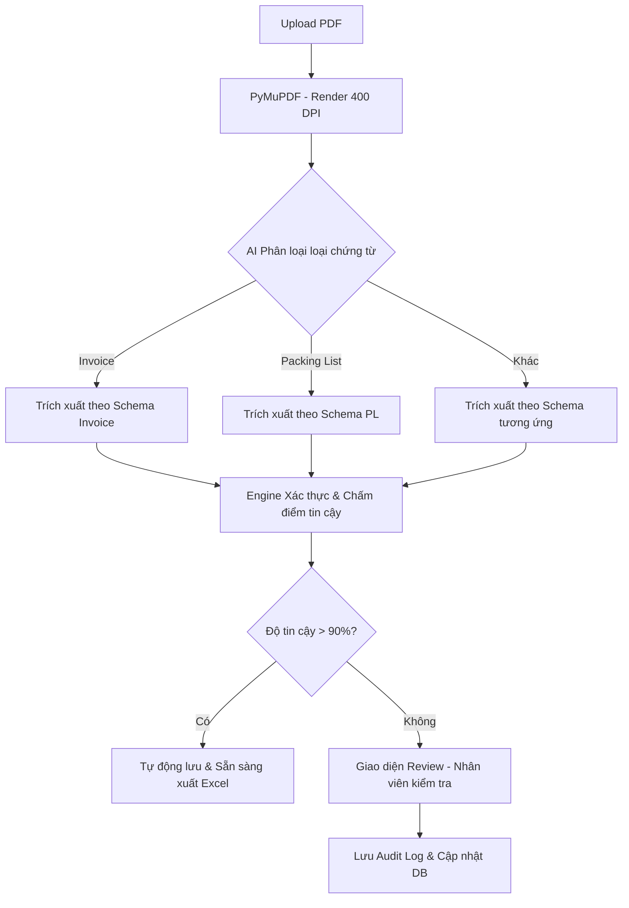

# Phân Tích Thiết Kế Hệ Thống 🏗️

## 1. Các quyết định thiết kế then chốt

Quyết định quan trọng nhất là **bỏ qua hoàn toàn OCR truyền thống**. Thay vì dùng chuỗi Tesseract → regex parsing → template matching, tôi gửi trực tiếp ảnh trang giấy tới **Gemini 2.5 Flash**. Điều này giúp hệ thống **không phụ thuộc vào layout** — nó hiểu chứng từ bằng thị giác giống như cách con người nhìn vào tờ giấy.

### Sơ đồ quy trình (Pipeline Workflow)

## 2. Lựa chọn Mô hình AI: Gemini 2.5 Flash
Tôi chọn **Gemini 2.5 Flash** vì đây là mô hình có hiệu năng trên giá thành (P/P) tốt nhất hiện nay, hỗ trợ xuất JSON native cực kỳ ổn định.

### Bảng so sánh chi phí (Dự kiến 3,000 chứng từ/tháng)
*Chi tiết bảng giá xem tại: [Google AI Pricing](https://ai.google.dev/pricing)*

| Thông số | Gemini 2.5 Flash | Ngân sách cho phép |
|---|---|---|
| Giá Input (1M tokens) | $0.30 (~7,500đ) | - |
| Giá Output (1M tokens) | $2.50 (~62,500đ) | - |
| **Chi phí TB / 1 chứng từ** | **~100đ - 250đ** | **1,600đ** |
| **Tổng chi phí / tháng** | **~600,000đ** | **5,000,000đ** |
| **Hiệu quả tiết kiệm** | **~88% ngân sách** | - |

> **Ghi chú:** Chi phí 100đ - 250đ cho mỗi file đã bao gồm việc đọc hiểu ảnh, trích xuất dữ liệu và sẵn sàng xuất ra file Excel. Đây là mức giá cực kỳ tối ưu so với việc thuê nhân sự nhập liệu thủ công.

## 3. Vòng lặp Kiểm soát viên (Human-in-the-loop)
Đây là yếu tố sống còn của hệ thống. Không bao giờ tin tưởng hoàn toàn vào AI. Mọi trường dữ liệu đều có điểm tin cậy. Nếu điểm thấp, chứng từ sẽ được đẩy về giao diện Streamlit để nhân viên duyệt lại. 

## 4. Những cải tiến trong tương lai
- **Học máy liên tục:** Lưu các bản sửa lỗi của nhân viên để làm mẫu cho AI học tập.
- **Quy tắc kiểm tra chéo:** Đối chiếu dữ liệu giữa Invoice, Packing List và BL để phát hiện sai lệch tự động.

## 5. Giả định về khối lượng
Dự toán chi phí dựa trên mức trung bình 3 trang/chứng từ. Với Gemini 2.5 Flash, ngay cả khi Packing List dài 20 trang, chi phí vẫn nằm trong tầm kiểm soát tuyệt đối.
